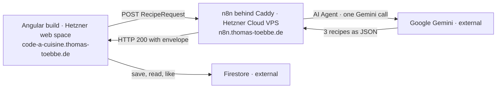

# Code à Cuisine

**Live: [code-a-cuisine.thomas-toebbe.de](https://code-a-cuisine.thomas-toebbe.de)**

A recipe generator built as a Developer Akademie project. You say what is still in the fridge and how
you want to cook — an n8n workflow has an LLM turn that into three recipes and hands them back to the
Angular frontend as JSON. All three suggestions land in a shared Firestore library (the "Cookbook")
automatically, where they can be found again and liked.

No sign-in, by design: the cookbook is public, everyone sees the same library, and there is no
account to create before cooking. That decision moves the entire protection into the
[Firestore security rules](firestore.rules) — see [docs/firebase.md](docs/firebase.md).

## How it runs in production



| Part           | Where it runs                                 | Gets there via                      |
| -------------- | --------------------------------------------- | ----------------------------------- |
| Frontend       | Hetzner web space (Apache), static build      | `deploy-frontend.yml` → SFTP mirror |
| Generation     | Hetzner Cloud VPS, n8n in Docker behind Caddy | `deploy-n8n.yml`, manually          |
| Recipe library | Firebase Firestore, collection `recipes`      | nothing to deploy, console only     |

The frontend is a plain static bundle — the Angular CLI build (esbuild/Vite under the hood) produces
HTML, JS and CSS, and Apache serves them with an `.htaccess` for the SPA rewrite. There is no server
of our own in front of the app.

The two paths never meet in the backend: n8n does **not** write to Firestore. The frontend talks to
Firestore directly and creates the three suggestions itself as soon as the response arrives.

Full walkthrough, secrets and the one-time server setup: **[docs/deployment.md](docs/deployment.md)**.

## Tech stack

- **Frontend:** Angular 21 (standalone components, signals), SCSS
- **Generation:** n8n workflow in Docker → Google Gemini (`gemini-3.5-flash`)
- **Library:** Firebase Firestore, collection `recipes` — external, same project in dev and prod

## Local development

Development runs entirely on your machine — including n8n, which the dev build calls on
`http://localhost:5678` instead of the VPS. Nothing here touches the live site; that only moves when
something lands on `main`.

```bash
npm install
cp src/environments/firebase.config.example.ts src/environments/firebase.config.ts
npm start           # http://localhost:4200
```

`firebase.config.ts` is gitignored and has to be copied and filled in by hand once per machine — no
npm hook does it for you. Until the `TODO-…` placeholders are replaced the app still runs, only the
Cookbook shows its error state.

| Concern          | Development                              | Production                                |
| ---------------- | ---------------------------------------- | ----------------------------------------- |
| App              | `ng serve` on `localhost:4200`           | static build on the web space             |
| Environment file | `environment.ts`                         | `environment.prod.ts` (swapped at build)  |
| Webhook          | `http://localhost:5678/webhook/…`        | `https://n8n.thomas-toebbe.de/webhook/…`  |
| Firebase config  | copied by hand from the example          | written from the `FIREBASE_CONFIG` secret |
| Quota per IP     | everything lands in the bucket `unknown` | real client IP via `x-forwarded-for`      |

The full walkthrough — Firebase values, rules, index and the local n8n setup — is in
**[docs/installation.md](docs/installation.md)**.

## npm scripts

| Command         | Purpose                                 |
| --------------- | --------------------------------------- |
| `npm start`     | Dev server on port 4200                 |
| `npm run build` | Production build into `dist/`           |
| `npm run watch` | Build in watch mode                     |
| `npm run lint`  | ESLint including Angular template rules |

## CI and deployment

GitHub Actions runs the same three commands on every push and pull request, and puts the site online
by itself once `main` moves:

| Workflow              | Runs on                                      | Does                                         |
| --------------------- | -------------------------------------------- | -------------------------------------------- |
| `ci.yml`              | push and pull request, any branch            | `npm ci` → `npm run lint` → `npm run build`  |
| `deploy-frontend.yml` | push to `main` touching the app, or manually | builds and uploads to the web space          |
| `deploy-n8n.yml`      | manually only                                | ships compose files and workflows to the VPS |

The nine required secrets, where each one comes from and the one-time server setup are in
**[docs/deployment.md](docs/deployment.md)**.

## Project structure

```
src/app/
  home/          Landing page, entry point into the wizard
  generator/     Wizard: ingredients, preferences, loading state, error dialog
  results/       List of the three suggestions
  recipe-view/   Recipe view — for suggestions and saved recipes alike
  library/       Cookbook: category tiles, card list, "Most liked" row
  header/        Header with the logo link back to the landing page
  footer/        Footer with the imprint link
  imprint/       Imprint
  models/        Interface and union types (request, response, recipe, filters)
  services/      n8n webhook, generation state, Firestore access
  firebase/      Firestore provider for the app config
  guards/        Route guards for the results page and the cuisine routes
  shared/        Pagination component and formatting helpers for recipe data
public/          Static assets copied into the build, plus the Apache .htaccess
n8n/             Both workflows as exported JSON
  deploy/        Compose file and Caddy config for the n8n server
docs/            Installation, architecture, webhook interface, Firebase, deployment
.github/
  workflows/     CI plus the two deployment workflows
```

## Documentation

- [docs/installation.md](docs/installation.md) — from `git clone` to a running app locally
- [docs/architecture.md](docs/architecture.md) — the big picture and the decisions behind it
- [docs/n8n-webhook.md](docs/n8n-webhook.md) — webhook interface, error codes, quota
- [docs/firebase.md](docs/firebase.md) — config, schema, rules, index, test data
- [docs/deployment.md](docs/deployment.md) — the live setup, secrets, and how a deployment runs
- [n8n/README.md](n8n/README.md) — importing the workflows, creating the credentials
