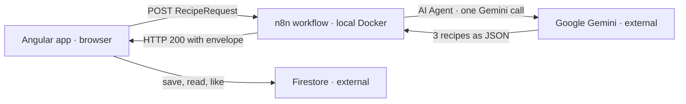

# Code à Cuisine

A recipe generator built as a Developer Akademie project. You say what is still in the fridge and how
you want to cook — an n8n workflow has an LLM turn that into three recipes and hands them back to the
Angular frontend as JSON. All three suggestions land in a shared Firestore library (the "Cookbook")
automatically, where they can be found again and liked.



The two paths never meet in the backend: n8n does **not** write to Firestore. The frontend talks to
Firestore directly and creates the three suggestions itself as soon as the response arrives.

## Tech stack

- **Frontend:** Angular 21 (standalone components, signals), SCSS — runs on `localhost:4200`
- **Generation:** n8n workflow in Docker → Google Gemini (`gemini-3.5-flash`) — runs on
  `localhost:5678`
- **Library:** Firebase Firestore, collection `recipes` — external

Deployed, the same two parts split across a static web space and a small cloud server —
see **[docs/deployment.md](docs/deployment.md)**.

## Getting started

```bash
npm install
cp src/environments/firebase.config.example.ts src/environments/firebase.config.ts
npm start           # http://localhost:4200
```

The full walkthrough — Firebase values, rules, index and the n8n setup — is in
**[docs/installation.md](docs/installation.md)**.

## npm scripts

| Command         | Purpose                                 |
| --------------- | --------------------------------------- |
| `npm start`     | Dev server on port 4200                 |
| `npm run build` | Production build into `dist/`           |
| `npm run watch` | Build in watch mode                     |
| `npm run lint`  | ESLint including Angular template rules |

## Project structure

```
src/app/
  home/          Landing page, entry point into the wizard
  generator/     Wizard: ingredients, preferences, loading state, error dialog
  results/       List of the three suggestions
  recipe-view/   Recipe view — for suggestions and saved recipes alike
  library/       Cookbook: category tiles, card list, "Most liked" row
  header/        Header with the logo link back to the landing page
  footer/        Footer with the imprint link
  imprint/       Imprint
  models/        Interface and union types (request, response, recipe, filters)
  services/      n8n webhook, generation state, Firestore access
  firebase/      Firestore provider for the app config
  guards/        Route guards for the results page and the cuisine routes
  shared/        Pagination component and formatting helpers for recipe data
public/          Static assets copied into the build, plus the Apache .htaccess
n8n/             Both workflows as exported JSON
  deploy/        Compose file and Caddy config for the n8n server
docs/            Installation, architecture, webhook interface, Firebase, deployment
```

## Documentation

- [docs/installation.md](docs/installation.md) — from `git clone` to a running app
- [docs/architecture.md](docs/architecture.md) — the big picture and the decisions behind it
- [docs/n8n-webhook.md](docs/n8n-webhook.md) — webhook interface, error codes, quota
- [docs/firebase.md](docs/firebase.md) — config, schema, rules, index, test data
- [docs/deployment.md](docs/deployment.md) — putting the site and n8n online
- [n8n/README.md](n8n/README.md) — importing the workflows, creating credentials
