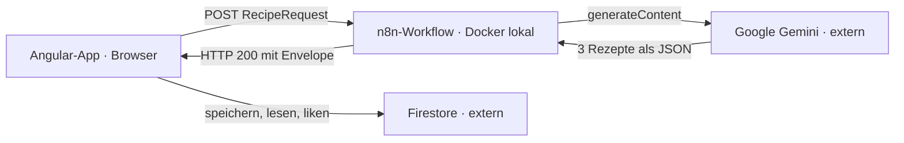

# Code à Cuisine

Rezept-Generator als Projekt der Developer Akademie. Man gibt an, was noch im Kühlschrank liegt und
wie gekocht werden soll — ein n8n-Workflow lässt daraus von einem LLM drei Rezepte erzeugen und
liefert sie als JSON an das Angular-Frontend zurück. Alle drei Vorschläge landen automatisch in einer
gemeinsamen Firestore-Bibliothek („Cookbook") und können dort wiedergefunden und geliked werden.



Die beiden Pfade kreuzen sich nie im Backend: n8n schreibt **nicht** nach Firestore, das Frontend
spricht Firestore direkt an und legt die drei Vorschläge selbst an, sobald die Antwort eintrifft.

## Tech-Stack

- **Frontend:** Angular 21 (Standalone Components, Signals), SCSS — lokal auf `localhost:4200`
- **Generierung:** n8n-Workflow in Docker → Google Gemini (`gemini-3.5-flash`) — lokal auf
  `localhost:5678`
- **Bibliothek:** Firebase Firestore, Collection `recipes` — extern

## Loslegen

```bash
npm install
cp src/environments/firebase.config.example.ts src/environments/firebase.config.ts
npm start           # http://localhost:4200
```

Der vollständige Weg inklusive Firebase-Werten, Rules, Index und n8n-Setup steht in
**[docs/installation.md](docs/installation.md)**.

## npm-Skripte

| Befehl          | Zweck                                 |
| --------------- | ------------------------------------- |
| `npm start`     | Dev-Server auf Port 4200              |
| `npm run build` | Produktionsbuild nach `dist/`         |
| `npm run watch` | Build im Watch-Modus                  |
| `npm run lint`  | ESLint inkl. Angular-Template-Regeln  |
| `npm run seed`  | Firestore mit Beispielrezepten füllen |

## Projektstruktur

```
src/app/
  generator/     Wizard: Zutaten, Präferenzen, Ladezustand, Fehlerdialog
  results/       Ergebnisliste der drei Vorschläge
  recipe-view/   Rezeptansicht — für Vorschläge und gespeicherte Rezepte
  library/       Cookbook: Kachel-Filter, Kartenliste, „Most liked"-Reihe
  models/        JSON-Verträge (Request, Response, Recipe)
  services/      n8n-Webhook, Generierungs-Zustand, Firestore-Zugriff
n8n/             Die beiden Workflows als exportierte JSONs
docs/            Installation, Architektur, Webhook-Vertrag, Firebase, Design-Mockups
scripts/         Seed-Skript für Testdaten
```

## Dokumentation

- [docs/installation.md](docs/installation.md) — von `git clone` bis zur laufenden App
- [docs/architektur.md](docs/architektur.md) — Gesamtbild und die Entscheidungen dahinter
- [docs/n8n-webhook.md](docs/n8n-webhook.md) — JSON-Vertrag, Fehlercodes, Quota
- [docs/firebase.md](docs/firebase.md) — Config, Schema, Rules, Index, Testdaten
- [n8n/README.md](n8n/README.md) — Workflows importieren, Credentials anlegen
