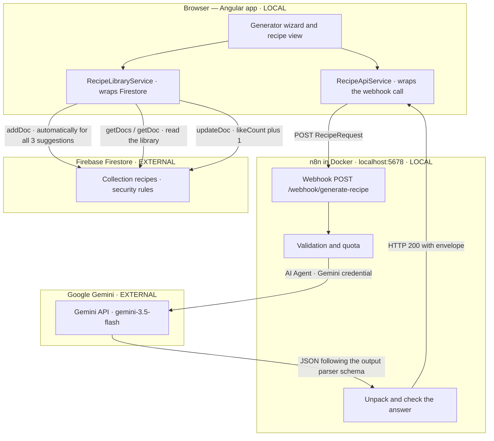

# Architecture

Two separate paths fan out from the browser. The **generation path** goes through n8n to the Gemini
API and back, the **library path** goes straight from the browser to Firestore. They never meet in
the backend.

## The building blocks

**Frontend (Angular 21, local on `localhost:4200`).** No component ever calls HTTP or Firestore
directly — everything goes through two services:
[`RecipeApiService`](../src/app/services/recipe-api.service.ts) is the only way into the workflow
(webhook URL from `environment`, 90 s timeout, every failure normalised into the
`RecipeErrorResponse` envelope), and
[`RecipeLibraryService`](../src/app/services/recipe-library.service.ts) is the only way into
Firestore (saving, reading with pagination and category filter, liking).

**n8n workflow (local, in Docker).** The webhook takes the POST, a code node validates the payload
server-side and reserves a quota slot, then an **AI Agent** node runs the single model call: the
system and user prompt come from the code node, the **Google Gemini Chat Model** sub-node holds model
and credential, and a **Structured Output Parser** sub-node pins the answer to the recipe schema. A
second code node unpacks the answer, cleans it up and checks it; only with exactly three valid
recipes does it go to the success respond node, otherwise to the error node. Both answer with
**HTTP 200** — the only discriminator is the `status` field in the body. A separate error handler
workflow catches unexpected crashes and sends a mail; expected failures (validation, quota, AI) never
reach it and come back as a regular envelope instead — the agent runs with _Continue (using error
output)_, so a failed model call takes the same path into the code node and leaves as an `ai_failed`
envelope rather than crashing the run.

**Google Gemini (external).** The one and only LLM call, triggered by n8n alone. The API key lives as
an n8n credential, never in the repository and never in the browser.

**Firestore (external).** The public library. The app has no sign-in, which is why the
[security rules](../firestore.rules) carry the entire protection.

## Two decisions that explain the setup

**n8n does not write to Firestore.** The write lives in the frontend:
[`RecipeGenerationService`](../src/app/services/recipe-generation.service.ts) creates all three
suggestions as soon as the response arrives. That way n8n never gets Firebase credentials, no service
account key exists anywhere, and the security rules stay the single line of defence.

**Saving happens automatically, not on a button.** `applyResponse()` writes the three recipes in
parallel, exactly once per run. The save is not awaited — navigation and the result list happen right
away. If a write fails, the result stays visible and only the like heart is disabled. The price of
that decision: the library also holds recipes nobody ever cooked. It sorts by `createdAt` and
`likeCount` respectively, so the unused ones drift to the back.

## Read on

- [docs/n8n-webhook.md](n8n-webhook.md) — webhook interface, error codes, quota
- [docs/firebase.md](firebase.md) — Firestore schema, rules, indexes, test data
- [n8n/README.md](../n8n/README.md) — importing the workflows and creating the credentials
