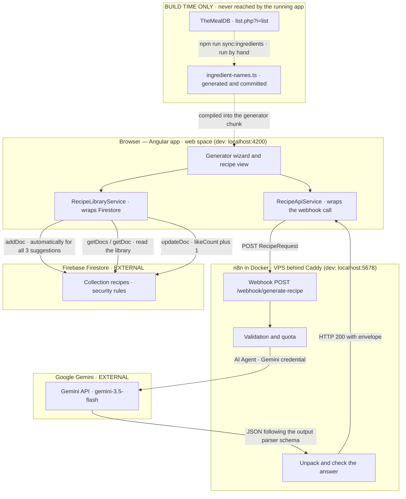

# Architecture

Two separate paths fan out from the browser. The **generation path** goes through n8n to the Gemini
API and back, the **library path** goes straight from the browser to Firestore. They never meet in
the backend.

A third external source, TheMealDB, appears in the diagram but carries no arrow at runtime: its
ingredient names are fetched once at build time and committed, so the running app never calls it.

## Where it runs

The same two paths run in both environments; only the two hosts differ, and the frontend learns which
one to call from `environment.recipeWebhookUrl` alone.

| Piece     | Development                    | Production                                     |
| --------- | ------------------------------ | ---------------------------------------------- |
| Angular   | `ng serve` on `localhost:4200` | static build on the Hetzner web space (Apache) |
| n8n       | Docker on `localhost:5678`     | Docker on a Hetzner Cloud VPS, Caddy in front  |
| Gemini    | external, same key             | external, same key                             |
| Firestore | external, same project         | external, same project                         |

Caddy is not decoration: the site is served over HTTPS, so a call to an `http` webhook would be
blocked as mixed content. It also terminates TLS, hides the n8n editor UI behind a 404 for everything
outside `/webhook/*`, and sets `x-forwarded-for` — which is what makes the per-IP quota work at all.
Details in [deployment.md](deployment.md).

## The building blocks

**Frontend (Angular 21).** No component ever calls HTTP or Firestore
directly — everything goes through two services:
[`RecipeApiService`](../src/app/services/recipe-api.service.ts) is the only way into the workflow
(webhook URL from `environment`, 90 s timeout, every failure normalised into the
`RecipeErrorResponse` envelope), and
[`RecipeLibraryService`](../src/app/services/recipe-library.service.ts) is the only way into
Firestore (saving, reading with pagination and category filter, liking).

**Ingredient autocomplete (frontend, no backend).** The suggestions and the spelling hint of step 1
read from [`ingredient-names.ts`](../src/app/generator/ingredient-step/ingredient-names.ts), a
generated file holding 1003 names: everything TheMealDB lists, merged with the hand-picked set the
app shipped before — the API is missing everyday entries like "Pasta", "Cauliflower" and
"Bell pepper", so it is a base to extend, not a replacement.
[`ingredient-matching.ts`](../src/app/generator/ingredient-step/ingredient-matching.ts) turns a typed
name into a hint only when it sits one or two edits away from a listed one — anything without a close
neighbour is accepted exactly as typed, because the point of the generator is whatever happens to be
in the kitchen. Names the user adds themselves are remembered per browser in
[`RecentIngredientsService`](../src/app/services/recent-ingredients.service.ts) and join their own
suggestions, never anybody else's.

Two rules are the exception to that openness, and
[`ingredient-blocklist.ts`](../src/app/generator/ingredient-step/ingredient-blocklist.ts) holds them:
a name that is not food ("Baumrinde", "Wespen") and a name written in another language ("Eier",
"Mehl") are rejected in the form instead of hinted at. Both exist because the name travels verbatim
into the prompt and comes back inside the recipe, which is then saved automatically — a joke or a
German name is not a passing annoyance but a permanent entry in the public library. The lists are
curated and by their nature incomplete: they stop what people actually typed, not everything
imaginable.

**n8n workflow (Docker).** The webhook takes the POST, a code node validates the payload
server-side and reserves a quota slot, then an **AI Agent** node runs at most two model calls per
request (`maxIterations` 2): system and user prompt come from the code node, while the
**Google Gemini Chat Model** sub-node holds model and credential and a **Structured Output Parser**
sub-node pins the answer to the recipe schema. A second code node unpacks the answer, cleans it up
and checks it; only with exactly three valid recipes does it go to the success respond node,
otherwise to the error node. Both answer with **HTTP 200** — the only discriminator is the `status`
field in the body. A separate error handler workflow catches unexpected crashes and sends a mail;
expected failures (validation, quota, AI) never reach it and come back as a regular envelope
instead — the agent runs with _Continue (using error output)_, so a failed model call takes the same
path into the code node and leaves as an `ai_failed` envelope rather than crashing the run.

**Google Gemini (external).** At most two model calls per request (`maxIterations` 2), triggered by
n8n alone. The API key lives as an n8n credential, never in the repository and never in the browser.

**Firestore (external).** The public library. The app has no sign-in, which is why the
[security rules](../firestore.rules) carry the entire protection.

## Four decisions that explain the setup

**There is no sign-in.** Nobody creates an account, the cookbook is one shared public library, and
the app ships no auth code at all. That keeps the way in short — the landing page leads straight into
the wizard — and it is why the security rules and the API key restriction have to be exact: they are
the only thing standing between the collection and the open internet. The cost airbag in n8n follows
from the same decision, since without accounts there is nobody to bill or rate-limit but an IP.

**n8n does not write to Firestore.** The write lives in the frontend:
[`RecipeGenerationService`](../src/app/services/recipe-generation.service.ts) creates all three
suggestions as soon as the response arrives. That way n8n never gets Firebase credentials, no service
account key exists anywhere, and the security rules stay the single line of defence.

**Saving happens automatically, not on a button.** `applyResponse()` writes the three recipes in
parallel, exactly once per run. The save is not awaited — navigation and the result list happen right
away. If a write fails, the result stays visible and only the like heart is disabled. The price of
that decision: the library also holds recipes nobody ever cooked. It sorts by `createdAt` and
`likeCount` respectively, so the unused ones drift to the back.

**The ingredient list ships in the bundle, not from an API.** `npm run sync:ingredients` pulls the
names from TheMealDB once and writes a committed TypeScript file; the app itself never calls that
API. A per-keystroke round trip would be the wrong latency budget for an autocomplete, the key would
be public in a static bundle anyway, and an outage would take the suggestions down with it. Growing
the list from the generated recipes instead was considered and dropped: `yourIngredients` echoes back
what the user typed, so an ignored typo would re-enter the corpus and make itself known — a
self-checking list cannot be fed by unchecked input.

## The design references are not in here

The Figma spec, the measurement reports, the fix protocols and the typography comparison are kept
outside the repository and maintained locally. They are working material for the layout, not part of
the running app, so a fresh clone is complete without them — nothing in the code or the other
documents depends on them.

## Read on

- [docs/n8n-webhook.md](n8n-webhook.md) — webhook interface, error codes, quota
- [docs/firebase.md](firebase.md) — Firestore schema, rules, indexes, test data
- [docs/deployment.md](deployment.md) — how the two halves get onto their hosts
- [n8n/README.md](../n8n/README.md) — importing the workflows and creating the credentials
