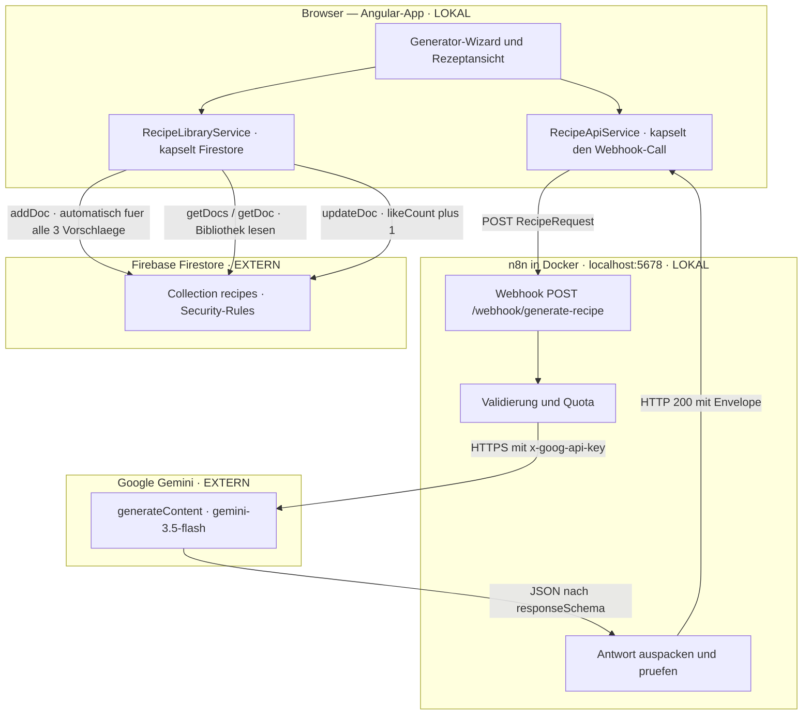

# Architektur

Zwei getrennte Pfade laufen sternförmig vom Browser aus. Der **Generierungspfad** geht über n8n zur
Gemini-API und zurück, der **Bibliothekspfad** direkt vom Browser nach Firestore. Sie kreuzen sich
nie im Backend.

## Die Bausteine

**Frontend (Angular 21, lokal auf `localhost:4200`).** Kein Component ruft je direkt HTTP oder
Firestore auf — alles läuft über zwei Services:
[`RecipeApiService`](../src/app/services/recipe-api.service.ts) als einziger Einstieg zum Workflow
(Webhook-URL aus `environment`, 90 s Timeout, jeder Fehler normalisiert auf die
`RecipeErrorResponse`-Envelope) und
[`RecipeLibraryService`](../src/app/services/recipe-library.service.ts) als einziger Einstieg zu
Firestore (Speichern, Lesen mit Paginierung und Kategoriefilter, Like).

**n8n-Workflow (lokal in Docker).** Der Webhook nimmt den POST entgegen, ein Code-Node validiert den
Payload serverseitig und reserviert einen Quota-Slot, dann ruft ein HTTP-Node die Gemini-API mit
erzwungenem `responseSchema`. Ein zweiter Code-Node packt die Antwort aus, säubert sie und prüft sie;
nur bei genau drei gültigen Rezepten geht es zum Erfolgs-Respond-Node, sonst zum Fehler-Node. Beide
antworten mit **HTTP 200** — Diskriminator ist allein das Feld `status` im Body. Ein separater
Error-Handler-Workflow fängt unerwartete Abstürze und schickt eine Mail; erwartete Fehler
(Validierung, Quota, KI) laufen nicht über ihn, sondern kommen als regulärer Envelope zurück.

**Google Gemini (extern).** Der einzige LLM-Aufruf, ausgelöst nur von n8n. Der API-Key liegt als
n8n-Credential, nie im Repo und nie im Browser.

**Firestore (extern).** Die öffentliche Bibliothek. Die App hat keine Anmeldung, deshalb tragen die
[Security-Rules](../firestore.rules) die gesamte Absicherung.

## Zwei Entscheidungen, die den Aufbau erklären

**n8n schreibt nicht nach Firestore.** Der Write liegt im Frontend:
[`RecipeGenerationService`](../src/app/services/recipe-generation.service.ts) legt alle drei
Vorschläge an, sobald die Antwort eintrifft. Damit bekommt n8n keine Firebase-Credentials, es
existiert nirgends ein Service-Account-Key, und die Security-Rules bleiben die alleinige Absicherung.

**Gespeichert wird automatisch, nicht per Button.** `applyResponse()` schreibt die drei Rezepte
parallel, genau einmal pro Lauf. Der Save wird nicht abgewartet — Navigation und Ergebnisliste laufen
sofort. Scheitert ein Write, bleibt das Ergebnis sichtbar und nur das Like-Herz deaktiviert. Preis
dieser Entscheidung: Die Bibliothek enthält auch Rezepte, die niemand nachgekocht hat; sie sortiert
nach `createdAt` bzw. `likeCount`, sodass Ungenutztes nach hinten rutscht.

## Weiter

- [docs/n8n-webhook.md](n8n-webhook.md) — Webhook-Schnittstelle, Fehlercodes, Quota
- [docs/firebase.md](firebase.md) — Firestore-Schema, Rules, Indexe, Testdaten
- [n8n/README.md](../n8n/README.md) — Workflows importieren und Credentials anlegen
