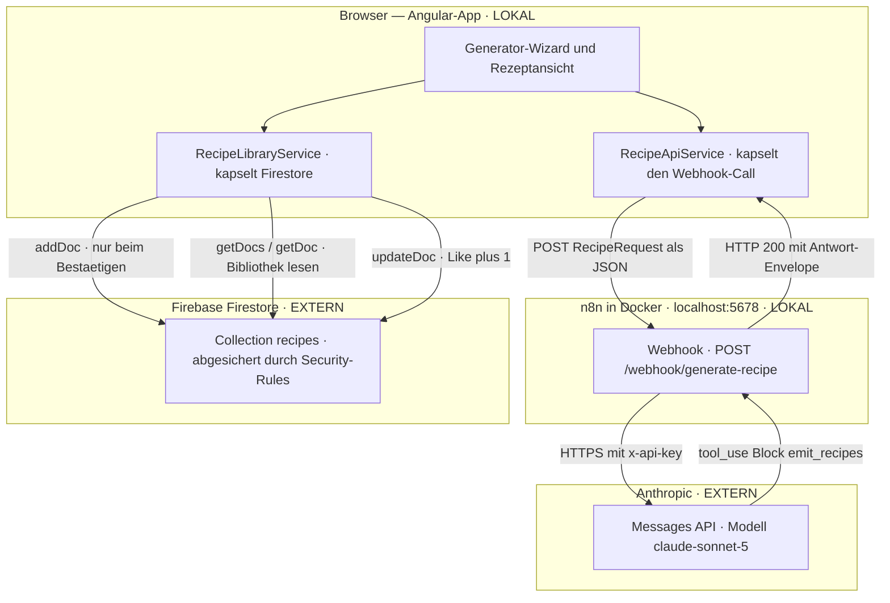
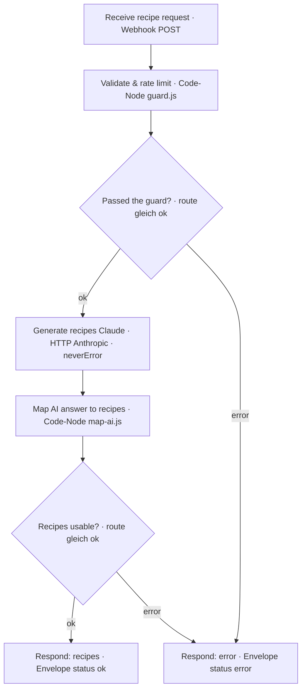
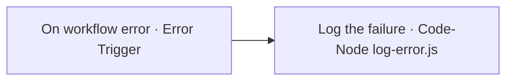
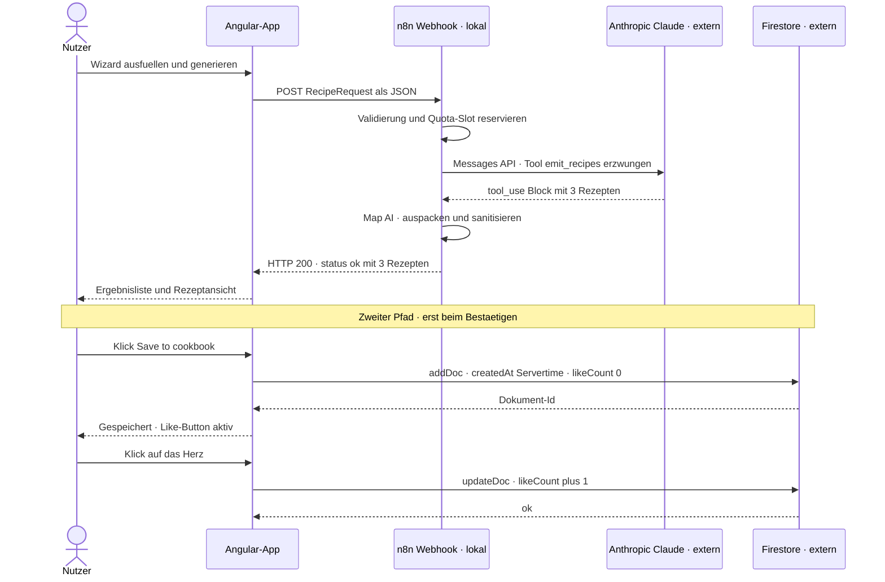

# Architektur — Code a Cuisine

Diese Doku bildet die **tatsächliche** Struktur des Projekts ab, so wie sie im Code und im
n8n-Workflow steht — nichts Erfundenes. Sie ist zum vollständigen Nachvollziehen gedacht: erst das
große Bild, dann der Workflow Node für Node, dann der Ablauf des Happy Path als Sequenz.

Verwandte Dokumente: [docs/n8n-webhook.md](docs/n8n-webhook.md) (JSON-Vertrag),
[docs/firebase.md](docs/firebase.md) (Bibliothek), [n8n/README.md](n8n/README.md) (Import und
Entscheidungen), [CLAUDE.md](CLAUDE.md) (Projekt-Anweisungen).

Kurzfassung des Stacks:

- **Frontend:** Angular 21 im Browser (Standalone Components, Signals) — läuft **lokal** auf
  `http://localhost:4200` bzw. `4300`.
- **Rezept-Generierung:** n8n-Workflow in Docker — läuft **lokal** auf `http://localhost:5678`.
- **LLM:** Anthropic Messages API (`claude-sonnet-5`) — **extern**, wird nur von n8n aufgerufen.
- **Bibliothek:** Firebase Firestore — **extern**, wird nur vom Frontend angesprochen.

---

## 1. Gesamtarchitektur

Zwei getrennte Pfade laufen sternförmig vom Browser aus. Der **Generierungspfad** geht über n8n zur
Anthropic-API und zurück. Der **Bibliothekspfad** geht direkt vom Browser nach Firestore. Die beiden
kreuzen sich nie im Backend — insbesondere schreibt n8n **nicht** nach Firestore (siehe unten).

### Bausteine

- **Generator-Wizard und Rezeptansicht (`ui`)** — die sichtbare App. Kein Component ruft je direkt
  HTTP oder Firestore auf; alles läuft über die beiden Services darunter (Vorgabe aus
  [CLAUDE.md](CLAUDE.md): keine `HttpClient`-Calls aus Components, dedizierter Service
  `providedIn: 'root'`).
- **RecipeApiService** ([src/app/services/recipe-api.service.ts](src/app/services/recipe-api.service.ts)) —
  einziger Einstieg zum Workflow. Nimmt die Webhook-URL aus `environment` (nie hartcodiert), setzt
  einen Timeout von 90 s und normalisiert **jeden** Fehler auf die `RecipeErrorResponse`-Envelope, die
  die UI schon versteht. Kann per `environment.useMockWebhook` auf lokale Fixtures umschalten.
- **RecipeLibraryService** ([src/app/services/recipe-library.service.ts](src/app/services/recipe-library.service.ts)) —
  einziger Einstieg zu Firestore (Collection `recipes`). Kapselt Speichern (`addDoc`), Lesen
  (`getDoc`/`getDocs` mit Paginierung und Kategoriefilter) und Like (`updateDoc` mit `increment(1)`).
- **Webhook-Node in n8n** — nimmt den POST entgegen und beantwortet den CORS-Preflight für die zwei
  Dev-Origins. Alles Weitere passiert in den nachgelagerten Nodes (Abschnitt 2).
- **Anthropic Messages API** — der einzige externe LLM-Aufruf, ausgelöst **nur** von n8n. Der
  API-Key liegt als n8n-Credential (`x-api-key`), nie im Repo, nie im Browser.
- **Firestore-Collection `recipes`** — die öffentliche Bibliothek. Da die App keine Anmeldung hat,
  tragen die **Security-Rules** ([firestore.rules](firestore.rules)) die gesamte Absicherung.

### Was lokal und was extern läuft

| Baustein             | Ort                         | Erreichbar über               |
| -------------------- | --------------------------- | ----------------------------- |
| Angular-App          | **lokal**, Browser          | `localhost:4200` / `4300`     |
| n8n-Workflow         | **lokal**, Docker           | `localhost:5678`              |
| Anthropic Claude     | **extern**, Anthropic-Cloud | HTTPS, nur aus n8n            |
| Firestore-Bibliothek | **extern**, Google Cloud    | Firebase-SDK, nur aus Browser |

### Warum n8n NICHT nach Firestore schreibt

Bewusste Entscheidung (siehe [n8n/README.md](n8n/README.md), Aufgabe 6). Der Firestore-Write gehört
ins Frontend und passiert **nur beim Bestätigen** eines Rezepts über
[RecipeSave](src/app/recipe-view/recipe-save/recipe-save.ts) →
`RecipeLibraryService.saveRecipe()`. Gründe:

- n8n liefert **drei** Vorschläge; gespeichert werden soll nur das **eine vom Nutzer bestätigte**.
  Würde n8n schreiben, wäre die Bibliothek mit unbestätigten Rezepten geflutet und beim Bestätigen
  dupliziert.
- n8n bekommt damit **keine** Firebase-Credentials. Es existiert nirgends ein Service-Account-Key
  (der würde sämtliche Rules umgehen). Die **Security-Rules bleiben die alleinige Absicherung** — der
  Client-Write muss durch sie hindurch.
- Der Kostenairbag (Quota) bleibt rein in n8n und wird davon nicht berührt.

---

## 2. Der n8n-Workflow „Code a Cuisine — Generate Recipe"

Quelle: [n8n/generate-recipe.workflow.json](n8n/generate-recipe.workflow.json). Der Workflow ist eine
lineare Kette mit zwei Weichen (`IF`-Nodes). Jeder Ausgang mündet in genau **einen** der beiden
Antwort-Nodes.

### Node für Node

**Receive recipe request** — Webhook-Node, `POST /webhook/generate-recipe`, `responseMode:
responseNode` (die Antwort liefert später ein eigener Respond-Node). Über `allowedOrigins`
(`http://localhost:4200,http://localhost:4300`) beantwortet er den **CORS-Preflight** (`OPTIONS`) für
die zwei Dev-Origins. TODO für Prod: deployte Origin ergänzen.

**Validate & rate limit** — Code-Node ([n8n/src/guard.js](n8n/src/guard.js)). Läuft einmal für alle
Items und tut drei Dinge, in dieser Reihenfolge:

1. **Server-seitige Validierung** des Request-Bodys (`collectValidationErrors`): mindestens eine
   Zutat mit `name`/`amount`/`unit`, `portions` 1–12, `cooks` 1–3, gültige `timeCategory`, `cuisine`
   und `diet`. Schlägt sie an, entsteht sofort ein `validation_failed`-Envelope und der LLM wird nie
   gerufen.
2. **Quota reservieren** (`reserveQuota`, der Kostenairbag) — Details unten.
3. **Anthropic-Request bauen** (`buildAnthropicBody`) — Details unten.

Der Node emittiert entweder ein `route: ok`-Item (mit sauberem Request, CORS-Origin und fertigem
Anthropic-Body) oder ein `route: error`-Item (mit `__error`-Envelope).

**Passed the guard?** — `IF`-Node auf `route == ok`. `ok` → weiter zum Modell; `error` → direkt zu
**Respond: error**. Damit erreichen abgelehnte oder überzählige Anfragen den LLM nie.

**Generate recipes (Claude)** — HTTP-Request-Node an `https://api.anthropic.com/v1/messages`.
Auth über die Header-Credential `x-api-key`, dazu fest `anthropic-version: 2023-06-01`. Body ist der
in guard.js gebaute `anthropicBody`. Wichtig: **`neverError: true`** — eine 4xx/5xx-Antwort von
Anthropic bricht die Ausführung **nicht** ab, sondern fließt als Body weiter (damit der bereits
reservierte Quota-Slot persistiert und der Map-Node sauber einen `ai_failed`-Envelope bauen kann).
Timeout 80 s.

**Map AI answer to recipes** — Code-Node ([n8n/src/map-ai.js](n8n/src/map-ai.js)). Packt die Rezepte
aus der Tool-Use-Antwort aus, säubert jedes Feld auf die `GeneratedRecipe`-Form und prüft es. Bei
jeder unbrauchbaren Antwort entsteht ein `ai_failed`-Envelope. Details unten.

**Recipes usable?** — `IF`-Node auf `route == ok`. `ok` → **Respond: recipes**; `error` →
**Respond: error**.

**Respond: recipes** — Respond-Node, `responseCode: 200`, Body `{ status: 'ok', recipes }`. Setzt den
CORS-Antwort-Header (siehe unten).

**Respond: error** — Respond-Node, `responseCode: 200`, Body ist die `__error`-Envelope. Gleiche
CORS-Header. Erreicht wird er aus drei Richtungen: Guard-Fehler (`validation_failed`,
`quota_*_exceeded`) und Map-Fehler (`ai_failed`).

### Der zweite Workflow: Error-Handler

Quelle: [n8n/error-handler.workflow.json](n8n/error-handler.workflow.json). Ein eigener Workflow, den
der Haupt-Workflow über `settings.errorWorkflow: codeacuisine-error-handler` referenziert.

- **On workflow error** — Error-Trigger, feuert nur bei einem **unerwarteten** Abbruch des
  Haupt-Workflows.
- **Log the failure** — schreibt eine lesbare Zeile (`workflow`, `node`, `error`, `url`) per
  `console.error` ins n8n-Log ([n8n/src/log-error.js](n8n/src/log-error.js)). Bewusst **ohne**
  Mailversand; der Node lässt sich später durch einen E-Mail-/Slack-Node ersetzen.

Wichtig zur Abgrenzung: Die **erwarteten** Fehler (Validierung, Quota, KI) laufen **nicht** über den
Error-Handler. Sie kommen als regulärer Envelope über **Respond: error** zurück. Der Error-Handler
fängt nur echte Abstürze (z. B. ein Node wirft eine unbehandelte Exception).

### Warum die Validierung serverseitig doppelt zum Frontend liegt

Das Frontend klemmt Werte bereits (Portionen 1–12, Köche 1–3) — trotzdem prüft guard.js dieselben
Regeln erneut. Grund: Der Webhook ist ein **offener HTTP-Endpunkt**. Ein Aufruf per `curl` oder ein
manipulierter Client umgeht jede Frontend-Prüfung. Die Server-Validierung ist die einzige, auf die
man sich verlassen kann; die Frontend-Prüfung ist nur Komfort (schnelles Feedback, keine unnötigen
Calls). Die Antwort ist deterministisch: bei ungültigem Payload ein `validation_failed`-Envelope,
noch bevor Quota oder LLM angefasst werden.

### IP-Quota / Kostenairbag (3 pro IP, 12 systemweit, dateibasiert)

Der Kostenairbag begrenzt die LLM-Kosten hart und läuft **ausschließlich serverseitig** in guard.js
(`reserveQuota`). Regeln:

- **3 Rezepte pro IP und Tag**, **12 systemweit pro Tag**. Reset um **Mitternacht UTC**;
  `retryAfter` in der Fehler-Envelope ist die nächste UTC-Mitternacht.
- Zähler stehen in einer **JSON-Datei** auf dem n8n-Datenvolume:
  `/home/node/.n8n/quota-state.json` (Form `{ day, system, perIp }`). Bewusst dateibasiert: n8n
  Static Data persistiert bei Webhook-Läufen nicht zuverlässig, ein harter Kostendeckel darf davon
  nicht abhängen. Erfordert `NODE_FUNCTION_ALLOW_BUILTIN` inkl. `fs`.
- **IP-Normalisierung** (`resolveIpKey`): Quelle ist `x-forwarded-for` (erster Eintrag), sonst
  `x-real-ip`. IPv4-mapped IPv6 (`::ffff:a.b.c.d`) → IPv4; IPv6 auf das `/64`-Präfix (erste vier
  Hextets); Zone-ID entfernt. Ohne erkennbare IP landet alles im Bucket `unknown`.
- **Reservierung vor dem LLM-Aufruf**: Der Slot wird gezählt, **bevor** Claude gerufen wird. So
  können wiederholte Fehlversuche das Budget nicht aushöhlen. Zusammen mit `neverError` am HTTP-Node
  bleibt der Zähler auch bei einer Anthropic-Fehlerantwort verbucht.
- Bei Überlauf: `quota_ip_exceeded` bzw. `quota_system_exceeded` mit passender `message` und
  `retryAfter`.

> Test-Hinweis: Ohne vorgelagerten Proxy setzt der Browser kein `x-forwarded-for`; auf `localhost`
> landet daher alles im Bucket `unknown`. Das systemweite Limit (12/Tag) greift trotzdem und ist der
> harte Deckel. (Randnotiz: [n8n/README.md](n8n/README.md) beschreibt an einer Stelle noch die frühere
> Static-Data-Variante — maßgeblich ist der aktuelle Code in guard.js, also die Datei
> `quota-state.json`.)

Das Frontend **zeigt** den Quota-Status nur an — es **prüft** nichts selbst und führt keine
Client-Zähler (Vorgabe aus [CLAUDE.md](CLAUDE.md), Quota-Regel).

### Claude-Aufruf per Tool Use (emit_recipes erzwingt das Schema)

`buildAnthropicBody` baut einen Messages-API-Request, der die Struktur **erzwingt** statt zu hoffen:

- `model: claude-sonnet-5`, `max_tokens: 8000`, dazu ein System-Prompt mit den harten Projektregeln
  (Diät strikt, gewünschte Küche/Portionen/Köche, `timeCategory` passend zur Kochzeit, ≥ 70 % der
  Nutzerzutaten wiederverwenden, max. 3 Zusatzzutaten, Arbeitsaufteilung bei `cooks > 1`, Nährwerte
  für `perPortion` **und** `total`, alles auf Englisch).
- Ein **Tool** `emit_recipes` mit `input_schema`, das exakt `{ recipes: [3 × GeneratedRecipe] }`
  beschreibt (`minItems: 3, maxItems: 3`, verschachtelt Zutaten, Schritte, Nährwerte).
- **`tool_choice: { type: 'tool', name: 'emit_recipes' }`** — das Modell **muss** dieses Tool
  aufrufen. Damit kommt die Antwort nicht als Freitext, sondern als strukturierter `tool_use`-Block,
  der dem Schema folgt. Das ist der Ersatz für „JSON-Mode" und macht die Weiterverarbeitung robust.

### coerceRecipes in map-ai.js — warum das Auspacken nötig ist

Trotz erzwungenem Schema ist die Tool-Eingabe in der Praxis nicht immer sauber die reine Liste.
`extractRecipes` sucht im `content` den `tool_use`-Block mit Name `emit_recipes`; `coerceRecipes`
wickelt dessen `input` dann rekursiv aus, weil Claude den Wert unterschiedlich verpackt hat:

- schon die **Liste** selbst, oder
- ein **`{ recipes: [...] }`**-Objekt, oder
- ein **JSON-String** von einem der beiden, oder sogar
- **doppelt verpackt** als `{ recipes: "<json-string>" }`.

`coerceRecipes` parst Strings, steigt durch `{ recipes }`-Ebenen ab (max. Tiefe 6) und gibt die erste
gefundene Array-Ebene zurück, sonst `null`. Danach wird jedes Rezept mit `cleanRecipe` neu aufgebaut
(Zahlen runden/klemmen, `assignedChef` in `1..cooks` klemmen, `extraIngredients` auf 3 kappen, Einheiten
auf `g`/`ml`/`piece` normalisieren) und mit `isValidRecipe` geprüft. Nur wenn **genau drei** gültige
Rezepte übrig bleiben, entsteht `route: ok`; sonst `ai_failed`. Dieses Säubern stellt sicher, dass die
Ausgabe später auch die **Firestore-Rules** passiert.

### Antwort-Envelope: immer HTTP 200, Feld `status` ok/error

Beide Respond-Nodes antworten mit **`responseCode: 200`** — auch im Fehlerfall. Diskriminator ist das
Feld `status` in der Envelope (`ok` vs. `error`), siehe [docs/n8n-webhook.md](docs/n8n-webhook.md).
Warum bewusst 200:

- Der `RecipeApiService` liest **Erfolg wie Fehler aus demselben 200er-Body** — ein einziger,
  einfacher Lesepfad im Frontend.
- Der HTTP-Status trägt keine fachliche Bedeutung; die fünf Fehlercodes (`validation_failed`,
  `quota_ip_exceeded`, `quota_system_exceeded`, `ai_failed`, `internal_error`) stehen im Envelope und
  steuern den passenden Dialog.
- Erst wenn **gar kein** brauchbarer Body ankommt (z. B. Transport-/CORS-Fehler, Timeout), fällt das
  Frontend selbst auf `internal_error` zurück (`buildTransportError` in
  [recipe-api.service.ts](src/app/services/recipe-api.service.ts)). `internal_error` kommt also **nie**
  aus n8n, sondern immer aus dem Client.

### CORS am Webhook

Zwei Stufen, beide im Workflow:

- **Preflight (`OPTIONS`)**: beantwortet der Webhook-Node über `allowedOrigins`
  (`localhost:4200,4300`).
- **Antwort auf den POST**: beide Respond-Nodes setzen `Access-Control-Allow-Origin` **reflektierend**
  — sie spiegeln `headers.origin` zurück, wenn er in der Allow-Liste steht, sonst `localhost:4200` —
  plus `Vary: Origin`. Ohne diese Header blockiert Chrome den Aufruf, und das Frontend zeigt den
  generischen `internal_error`-Dialog.

---

## 3. Sequenzdiagramm — Happy Path

Vom Wizard bis zum Like, ohne Fehlerabzweige. Man sieht, dass **n8n und Firestore nie direkt
miteinander reden** — der Browser ist der einzige gemeinsame Punkt.

### Ablauf im Detail

1. **Nutzer → Angular:** Der Generator-Wizard sammelt Zutaten und Präferenzen; `generate()` in
   [RecipeGenerationService](src/app/services/recipe-generation.service.ts) baut den `RecipeRequest`,
   setzt den Status auf `loading` (Ladeanimation) und ruft den `RecipeApiService`.
2. **Angular → n8n:** `RecipeApiService.generateRecipes()` schickt den POST an
   `environment.recipeWebhookUrl` mit 90-s-Timeout.
3. **n8n intern:** Guard validiert und reserviert einen Quota-Slot (siehe Abschnitt 2).
4. **n8n → Anthropic:** HTTP-Node ruft die Messages API mit erzwungenem `emit_recipes`-Tool.
5. **Anthropic → n8n:** Claude liefert den `tool_use`-Block mit drei Rezepten.
6. **n8n intern:** Der Map-Node packt aus (`coerceRecipes`), säubert und prüft; drei gültige Rezepte →
   `route: ok`.
7. **n8n → Angular:** **Respond: recipes** antwortet HTTP 200 mit `{ status: 'ok', recipes }`.
8. **Angular → Nutzer:** `applyResponse` legt die Rezepte in den Signals ab und navigiert auf
   `/results`. Die Vorschläge liegen **nur im Speicher** — ein Reload schickt bewusst zurück in den
   Wizard (es sind Vorschläge, keine gespeicherten Rezepte).
9. **„Save to cookbook":** Erst hier entsteht ein Firestore-Dokument.
   [RecipeSave](src/app/recipe-view/recipe-save/recipe-save.ts) ruft `saveRecipe()`;
   `buildRecipeDocument` ergänzt `createdAt: serverTimestamp()` und `likeCount: 0` und `addDoc`
   schreibt durch die **Security-Rules** (Feld-Whitelist, Wertebereiche, `createdAt == request.time`,
   `likeCount == 0`). Zurück kommt die Dokument-Id.
10. **Like:** Nach dem Speichern ist der Like-Button aktiv
    ([RecipeLike](src/app/recipe-view/recipe-like/recipe-like.ts)). Der Klick ruft `incrementLike()`
    → `updateDoc(..., { likeCount: increment(1) })`. Die Rules erlauben als einzige Änderung genau
    `likeCount + 1`; der Zähler lebt auf dem Server, sodass parallele Likes sich addieren statt sich
    zu überschreiben. Ein Delete ist nie erlaubt.

---

## Quellen

Alles oben ist aus diesen Dateien abgeleitet:

- [n8n/generate-recipe.workflow.json](n8n/generate-recipe.workflow.json),
  [n8n/error-handler.workflow.json](n8n/error-handler.workflow.json)
- [n8n/src/map-ai.js](n8n/src/map-ai.js), [n8n/src/log-error.js](n8n/src/log-error.js),
  [n8n/README.md](n8n/README.md)
- [docs/n8n-webhook.md](docs/n8n-webhook.md), [docs/firebase.md](docs/firebase.md)
- [src/app/services/recipe-api.service.ts](src/app/services/recipe-api.service.ts),
  [src/app/services/recipe-generation.service.ts](src/app/services/recipe-generation.service.ts),
  [src/app/services/recipe-library.service.ts](src/app/services/recipe-library.service.ts),
  [src/app/services/recipe-document.ts](src/app/services/recipe-document.ts)
- [src/app/recipe-view/recipe-save/recipe-save.ts](src/app/recipe-view/recipe-save/recipe-save.ts),
  [src/app/recipe-view/recipe-like/recipe-like.ts](src/app/recipe-view/recipe-like/recipe-like.ts),
  [src/app/recipe-view/recipe-view.ts](src/app/recipe-view/recipe-view.ts)
- [src/environments/environment.ts](src/environments/environment.ts),
  [firestore.rules](firestore.rules), [CLAUDE.md](CLAUDE.md)
